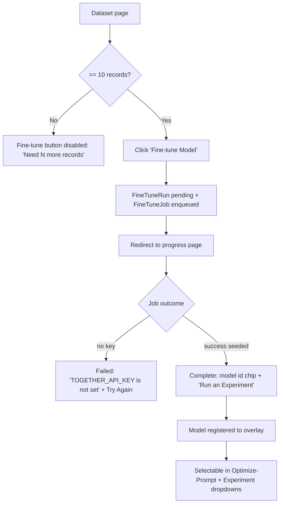

# Dogfood Report — feat/dataset-fine-tune-register-model

Date: 2026-05-25 · Branch: `feat/dataset-fine-tune-register-model` · PR #38

## Diff Summary

Adds dataset fine-tuning via Together AI and registers the resulting model in
RubyLLM so it becomes selectable. New: `Leva::Providers::Together` (boot-registered),
`Leva::ModelRegistrar` (overlay persistence + registry sync), `JsonlExporter` +
`FineTuners::Together`, `FineTuneRun` model/migration/`FineTuneJob`, and the dataset
trigger UI + polling progress page.

## Personas

- **ML/AI engineer using Leva to evaluate LLMs** (inferred — no `STRATEGY.md`/`VISION.md`/`PERSONAS`). Wants to produce a fine-tuned model from a dataset they already hold and have it become selectable for evals, with clear progress/failure feedback and no wasted spend on broken runs.

## Runtime

Dummy app at `/leva`, ActiveJob `:async`, cache `:null_store`, no `TOGETHER_API_KEY` (so the live job fails — exercises the failure path). Seeded: Dataset A "Support Tickets" (12 records, a completed+registered run, a failed run); Dataset B "Tiny Set" (3 records).

## Flows tested

## Test Matrix & Results

| # | Scenario | Status | Notes |
|---|----------|--------|-------|
| S1 | Dataset page (>=10): section + enabled button + runs table | ✅ Pass | COMPLETED+FAILED rows, model id shown, no console errors |
| S2 | Dataset page (<10): disabled button "Need N more records" | ✅ Pass | "Need 7 more records" + empty state |
| S3 | Click Fine-tune → pending run + redirect to progress | ✅ Pass | Created run #4, redirected to `/leva/fine_tune_runs/4` |
| S4 | No-key async job fails → sanitized failure + Try Again | ✅ Pass | `error_message="TOGETHER_API_KEY is not set"` (1 line, no payload) |
| S5 | Completed progress page: model id chip + CTAs | ✅ Pass | "Now selectable as kieran/Qwen3-8B-support-1" + CTAs |
| S6 | Registered fine-tune selectable in dropdowns (payoff) | ✅ Pass | Optimize-Prompt: "Support Tickets fine-tune #2 (together)"; experiment form too |
| S7 | Failed progress page (seeded): sanitized error + Try Again | ✅ Pass | Try Again re-POSTs `create` with the same base model |
| S8 | Persona paper-cut pass | ✅ Pass | Paper cuts logged below; no functional defects |

**Functional result: PASS (7/7).** No console errors on any page. No autonomous fixes required — nothing was broken.

## What was fixed

Nothing — the branch is functionally sound end-to-end. (The substantive correctness/reliability fixes were already applied during the earlier `ce-code-review` autofix pass on this branch; this dogfood found no new functional defects.)

## Paper cuts (by persona)

ML/AI engineer:
- **PC1 (medium) — No base-model choice in the UI.** "Fine-tune Model" is one-click with a hardcoded `Qwen/Qwen3-8B`. The persona's whole job is *comparing* models, and `SUPPORTED_BASE_MODELS` already lists 4 (Qwen3-8B/4B, Qwen2.5-7B, Gemma-2-9B) — none are exposed. Deliberate scope choice (one-click), but a real gap for this persona. → see Decisions for a human.
- **PC2 (low-med) — No cost/data-boundary cue before clicking.** Fine-tuning uploads dataset rows to Together and costs money; the button gives no inline hint or confirmation (documented in README only). Recommend a short subtext/`title` on the button.
- **PC3 (low) — "Run an Experiment" doesn't pre-select the fine-tuned model.** The completed-page CTA lands on the experiment form but the user must re-pick the model. Minor; could pass the model via query param.
- **Positive:** the no-key failure surfaces a clear, actionable `"TOGETHER_API_KEY is not set"` rather than a stack trace — good.

## Decisions for a human

- **D1 — Expose a base-model selector in the Fine-tune UI?** Today it's one-click (`DEFAULT_BASE_MODEL`). Options: (a) keep one-click (matches the plan's "thin trigger" intent, simplest); (b) add a small dropdown of `SUPPORTED_BASE_MODELS` (inline or on a `new` page) so the eval persona can compare base models. **Recommendation:** add a lightweight dropdown in a follow-up — it directly serves the comparison workflow that is Leva's reason to exist — but it's a UX scope expansion beyond this PR, so flagging rather than auto-applying. Not a blocker for merge.

## Learnings

- **The overlay re-hydration design works cross-process (validated live).** A model registered in a `rails runner` process appeared in the running server's model dropdowns via `available_models → ModelRegistrar.sync!` reading the overlay file. This is the load-bearing payoff of the architecture, and it holds without rewriting RubyLLM's catalog.
- **Browser-testing Rails `button_to` controls:** `agent-browser click` on a `button_to` submit button did not trigger form submission; `form.submit()` via `eval` did. Use form submission (or verify navigation) when dogfooding `button_to` actions, to avoid false "nothing happened" negatives. (App behavior is correct — real-browser clicks submit; the controller test also covers `create`.)

## Final Status

**Functionally ready to merge.** All 7 functional scenarios pass with no console errors; the failure path is graceful and the core payoff (fine-tuned model becomes selectable) works end-to-end and cross-process. Paper cuts are non-blocking UX follow-ups; one decision-for-a-human (base-model selector) is recommended for a later PR.

Still pending (unchanged from PR #38): **manual end-to-end against a live `TOGETHER_API_KEY`** — HTTP is stubbed in tests and the served LoRA id format is provider-specific.
